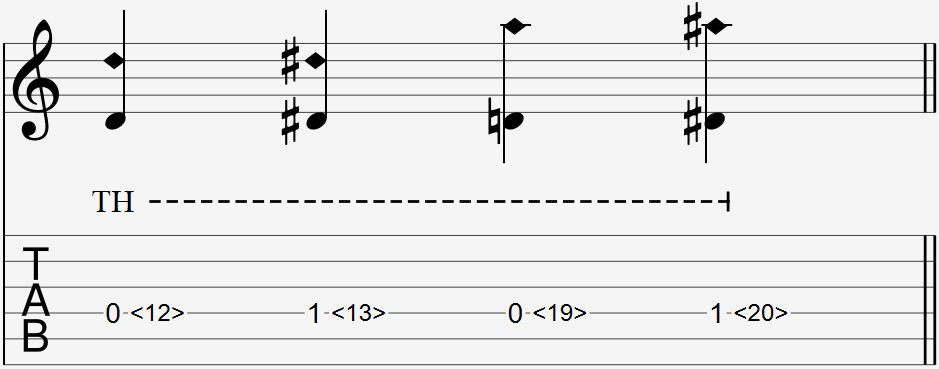

  

Similar to an artificial harmonic, the tap harmonic has many ways to be notated, with T.H. instead of A.H. being commonly written above the harmonic. If the T.H. extends to multiple notes in a row with a dashed line, all those notes are tap harmonics.

For example:

- 1<20> with T.H. above - left hand presses on fret 1; right hand flicks fret 19
- <19> with T.H. above - right hand flicks fret 19
- <0> or 0 with T.H. above - right hand flicks fret 12

### Explanation

A tap harmonic is played by quickly flicking a right finger towards the fretboard at a single string at any fret that can be played with an artificial harmonic. 

It is easier to produce a note by flicking the string down to make contact with the fret wire itself, but it also produces a 'click' sound.

Your finger does not follow through with the string to push it down to the fret wire and after flicking it, and must immediately bounce back to not mute the string as it returns to it's original position. 

#### Common Harmonic Frets

For your reference. The parentheses () show the intervals of the harmonic note when compared to the open string or the fretted note.

- 1/2 = <12> (Octave)
- 1/3 = <7> <19> (Octave + 5th)
- 1/4 = <5> <24> (2 Octaves)
- 1/5 = <4> <9> <16> <28> (2 Octaves + 3rd)
- 1/6 = <3.2> <30> (2 Octaves + 5th)