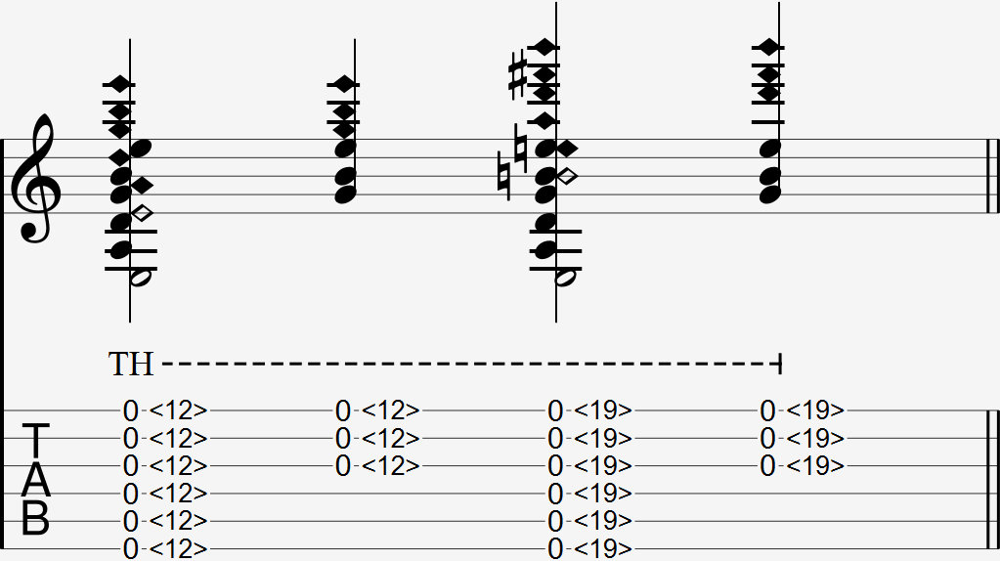

  

The slap harmonic is notated with multiple tap harmonics together, with T.H. commonly written above the harmonic.

### Explanation

A slap harmonic is multiple tap harmonics played together by flicking multiple strings simultaneously with the index or middle finger - whichever is more comfortable.

Like a tap harmonic, your finger does not follow through with the strings to push it down to the fret wire and after flicking them, and must immediately bounce back to not mute the strings as it returns to it's original position. 

#### Common Harmonic Frets

For your reference. The parentheses () show the intervals of the harmonic note when compared to the open string or the fretted note.

- 1/2 = <12> (Octave)
- 1/3 = <7> <19> (Octave + 5th)
- 1/4 = <5> <24> (2 Octaves)
- 1/5 = <4> <9> <16> <28> (2 Octaves + 3rd)
- 1/6 = <3.2> <30> (2 Octaves + 5th)

### FAQ

#### Should my slapping finger be parallel to the frets?

The finger you use to slap harmonic with only has to be parallel to the strings if you are aiming to slap all 5 or 6 strings. In most cases, you'd be slapping 3. While slapping 3 strings, choosing to be parallel would give your notes slightly more clarity. However, it will also require your hand to travel more distance towards the slapping location. 

As a rule of thumb, only do this if you have the time to move your hand to the slapping location and back before the next note. Otherwise, it's okay to not be parallel to the frets.