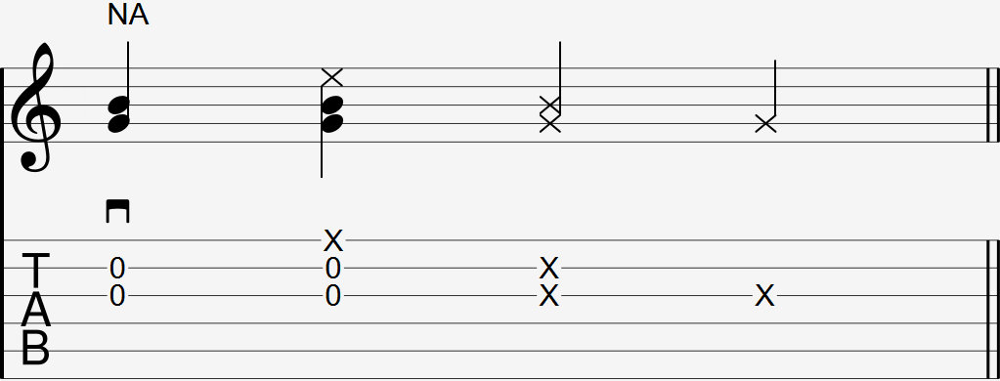

Video: 
- nail attack (side)
- nail attack pinky anchor (side)
- nail attack mute (side)
- nail attack mute pinky anchor (side)
- 1. the flicking motion (thenar eminence)
- 1. the flicking motion (without windup)
- 2. Flicking a piece of paper
- 3. Flicking your guitar strings

  

The nail attack has many different ways of being notated. Common ways include:

- Downstroke icon with "NA" written above
- One or two Xs on the middle strings
- X directly above a note

In some countries, this technique is referred to as the "Attack Mute", or "AM". If you see that instead of "NA", it most likely means this same nail attack technique.

### Explanation

The nail attack is a unique percussive technique by master guitarist Kotaro Oshio. 

Unlike other common percussive techniques such as the thumb slap, the percussive sound comes from your nails making contact with the strings, not your strings making contact with the fret wire.

### Learning the Nail Attack

This technique's learning process is similar to that of riding a bicycle without training wheels. You struggle doing the motion for some time and one day, you are able to do it and have no idea why.

This is because like any technique, you need to build up muscle memory. This case is even more true for the nail attack technique. Without this muscle memory, it will be awkward to do the technique correctly and consistently. 

This guide aims to make the process easier by building muscle memory through motions your hands are likely already accustomed to. Everyone learns differently and this technique can take you up one month to learn and get used to, so don't feel discouraged from a lack of noticeable progress.

Since this technique has no prerequisites but has multiple steps to learn, it will be separated into 5 sections. Refer to the video for the demonstration of each section.

#### 1. The flicking motion

Push your middle and ring finger into the base of your thumb (medical term is "Thenar Eminence") and flick outwards, straigtening your fingers.

Now attempt the same motion without first pushing the fingers into the base of your thumb and the releasing. It is normal to have less power in the flicking motion than before.

#### 2. Flicking a piece of paper

Try doing the same flicking motion(s) described above, but on a piece of paper instead. Instead of following through by straightening your fingers, make your fingers bounce back once your fingernails make contact with the paper. your wrist and arm should remain in the same position and not assist your fingers with this flick.

The flick on the piece of paper should sound like a gunshot. Do this as a check to ensure you have the flicking motion correct before moving on the next step. Make sure the only part of your fingers coming in contact with the piece of paper are the back of your fingernails.

#### 3. Flicking your guitar strings

Now transfer this same motion of flicking the piece of paper to flicking the guitar strings. It's important to remember that the basic nail attack is not a strum, so like the previous step, you should not be using your wrist and arm to assist you with the flick.

As soon as the back of the fingernails make contact with the string, bounce them back towards the palm of your hand again to prepare for the next nail attack. Your goal is to get a percussive sound out of it. It is also normal for the strings to ring after flicking them, as long as you didn't do a strum.

For now, your hand should not be moving much when first attempting this technique. Once you can perform the technique properly with minimal hand movement, you can add more motion to it from your wrist and arm, which will be discussed in step 5 on this page.

#### 4. Nail Attack

Once you have transferred the flicking motion from the piece of paper in step 2 to the guitar strings, you can add a wrist movement to the flick. Limit this movement to only move closer and away from the strings. 

The nail attack is the percussive sound resulting from the combined motion of your middle and ring fingernails hitting the strings while your wrist moving towards and away from your strings.

This motion gives you more control over the nail attack, and makes it easier to to reposition your hand to pick strings immediately before and after the nail attack.

#### 5. Nail Attack Mute

If you don't want any other strings to ring as a result of a nail attack,  A nail attack mute is the nail attack, but instead of bouncing your fingers back after flicking the strings, the fingers remain on the strings briefly to mute them and stop them from ringing. This allows for the nail attack to prevent other strings from unintentionally ringing.

Your nails should stop and remain on the strings the instant it hits the strings and produces the percussive sound.

### FAQ

#### Should my pinky be anchored below the soundhole?

Performing a nail attack is more difficult if you anchor your pink below the soundhole throughout the entire movement. Instead of anchoring it all the time, briefly lift the pinky off the guitar's soundboard when you use your wrist to move your fingers away from the guitar, and place it back down during the nail attack itself. This adds a subtle effect of your pinky hitting the guitar's soundboard.