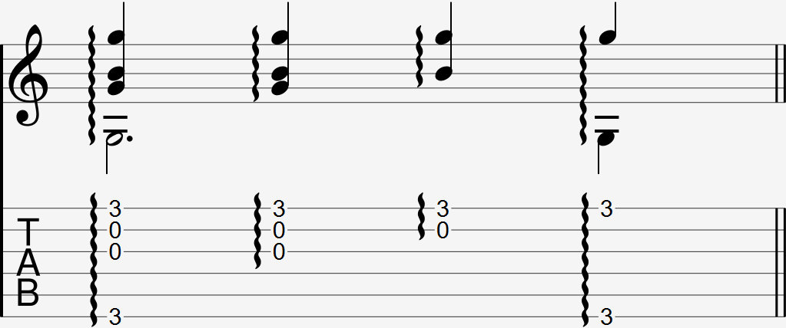

### Notations 

  

The finger roll is notated as a group of notes with a wave-like line next to it. Sometimes this wave-like line is notated with an arrow indicating the string order to perform the finger roll in. If you don't see an arrow, perform the technique in the usual order, from thumb to ring.

### Explanation

The finger roll plays multiple strings in quick succession using the fingers on your right hand. Similar to a downwards strum, multiple strings are picked in quick succession.  

Starting from the lowest string of the group of strings, pick each string in the order of thumb, middle, index, and ring finger, with equal timing between each string. If you encounter a finger roll with less than 4 notes, use the fingers that are most convenient to perform the technique with.

You can also do the finger roll in a reverse order, starting from the highest string of the group of strings. However, this is rarely used and slightly more difficult.

#### If you need more help

Your end goal should be to perform a finger roll without having to do the following. Think of the following as training wheels that may help you get used to the motion before moving on to the proper form.

- Apply pressure to each string as if you were preparing to pick them towards your palm. Instead of following through and picking them, maintain this pressure as you lift your hand away from the strings. The pressure you put on the strings will be released and the notes will ring.
- Rotate your wrist slightly clock-wise so that the index finger naturally leaves the string first, then your middle, then your ring. 

Once you're comfortable playing the finger roll using these methods, practice the finger roll without them.