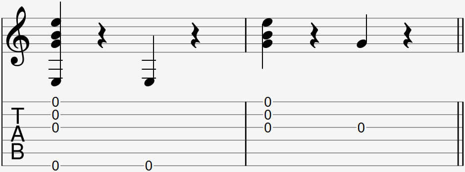

Video:
- play one note and mute with finger
- play one note and mute with whole left hand
- play 4 notes and mute
- play one note and plant
- play 4 notes and plant

### Notation

  

There is no special way to notate a mute. Look at the rhythmic portion of the sheet music (usually above the tab) for a rest symbol. That is when you should mute the string(s). 

### Explanation

A mute (left hand) or plant (right hand) is a technique used to stop a string or multiple strings from ringing. 

#### Mute (left hand)

Place any left finger on the string without pressing down to the frets to stop it from ringing. 

#### Plant (right hand)

Place any right finger on the string in the position you use to prepare for a pick to stop it from ringing. 

