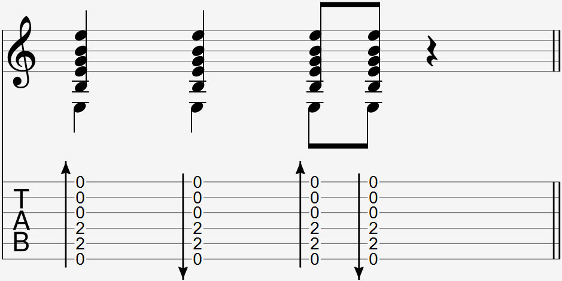

Video:
- strum down with ring+middle
- strum down with index
- strum up with index
- strum up with thumb
- ring+middle down, index up
- ring+middle down, thumb up
- index down, index up
- index down, thumb up
- index down, thumb up (but holding together)

### Notation

  

A strum is notated with an arrow next to a group of notes indicating the strum direction.  

### Explanation

You may be familiar with strumming using a pick/plectrum. In fingerstyle, since we do not have picks, we use our fingers to strum. 

As fingerstyle guitarists grow to develop their own style, their strumming technique changes with them. Common ways to strum down include the middle and ring finger or the index, and common ways to strum up include the index or thumb. Use whatever is more comfortable for you.

To strum down, hold either your middle and ring (together) or index finger in a relaxed, curled position as you brush the back of your nails across the strings in a downward motion. 

To strum up, drag your index finger or the back of your thumbnail across the strings in an upward motion. Again, relax these fingers and don't tense up.

Both strums down and up should make use of your arm and wrist. It's good to practice both aggressive and gentle strumming to introduce variety your playing.

