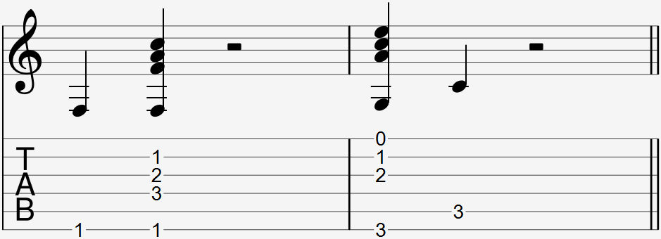

Video:
- F chord standard Thumbover
- F chord drop D Double thumbover the part from omake pfadlib

  

There is no special way to notate a thumb-over. You can use the thumb-over whenever you only need to play the lowest string of a chord that is normally barred, such as the altered F major as shown in the tab. The thumb-over can hold down the F note bass low E string with the thumb and use the remaining fingers to hold down the rest of the chord while letting the high E string ring open.

### Explanation

A thumb-over can be used in place of another finger to hold down the lowest string or lowest 2 strings to give the other fingers more freedom to be placed elsewhere.

To make a thumb-over position more comfortable, move your wrist higher to give your thumb more space to perform a thumb-over with. This may make it less comfortable if you're pressing down on the other strings with your other fingers, so find a balance that works for you.