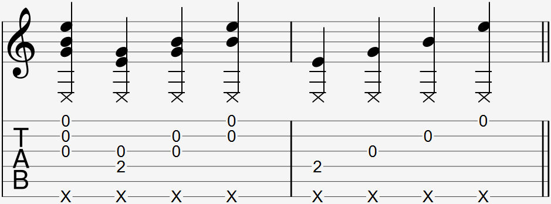

  

The thumb slap strum is most commonly notated as an "X" below a set of notes, where the X indicates the thumb slap and the notes indicate the strum. Sometimes, there will also be a strum arrow indicating the strum.

### Explanation

The thumb slap strum is an expansion if the thumb slap technique by doing a quick strum with your fingers at the same time as a thumb slap. This technique is done by slightly extending or "flicking" your index and/or middle fingers while simultaneously slapping the lower string(s) with your thumb. 

In order for the thumb slap strum to be done correctly, the strum must be done quickly enough so that it sounds like the slap happens at the same time. If the strum takes too long, then it will not sound right.

#### Targeting specific strings

The thumb slap strum becomes more complicated when you only want to play notes on certain strings. Targeting specific strings can be difficult even for intermediate players, and requires a good deal of practice and patience to perfect the technique.

In order to target the strings you need, you will need to control your finger movements to prevent hitting the wrong strings. You can also deaden the strings you're not playing by muting them, which is usually a lot easier.

For a consistent method of targeting specific strings that doesn't require muting strings, consider using a [thumb slap pluck](4).