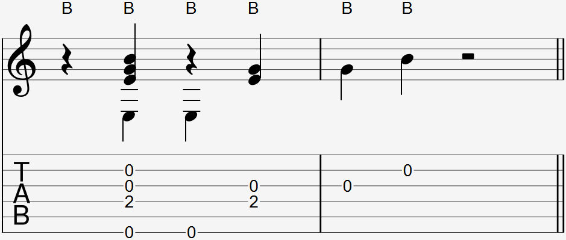

Video:
- Bridge thump
- Bridge thump with picking before and after

### Notation

  

The bridge thump is commonly notated as a B above the notation and/or tab. If the notation and/or tab shows an O above a segment that is palm muted, assume it is a bridge thump.

### Explanation

The bridge thump is used in place of a wrist thump when your hand is in the palm muting position at the guitar's bridge. 

To perform a bridge thump, start from the palm muting position and briefly move your hand away from the guitar, then hit the bridge by quickly moving your hand back down to palm muting position. Like any percussive technique, control the power behind the hit to not make the thump sound too loud or break the guitar.

Taking off your hand from the guitar will result in the palm muted strings ringing more clearly for a brief period of time, but as long as you palm muted during the pick of your last played note before the bridge thump, then the difference won't be noticeable.

When performing the bridge thump and pick at the same time, the palm muted notes should be muted while every other note should ring normally. 

#### Bridge thump without muting strings

To not mute any strings, simply move your hand to the right and off the strings while still performing the same thump motion.

#### picking a bass note while doing a bridge thump

Like the wrist thump, place your thumb on the string you intend to pick and apply pressure as if you're about the pick. When you do the bridge thump, move your thumb away from the string. Pay attention to make sure you pick and bridge thump at the same time, as it is very easy to mistakingly first bridge thump then pick.

#### picking other notes while doing a bridge thump

Like the wrist thump, place your finger(s) on the strings you intend to pick. When you do the bridge thump, pull your fingers towards your palm. This motion, combined with your bridge arching back, will pull the fingers away from the string and pick them like any other pick.