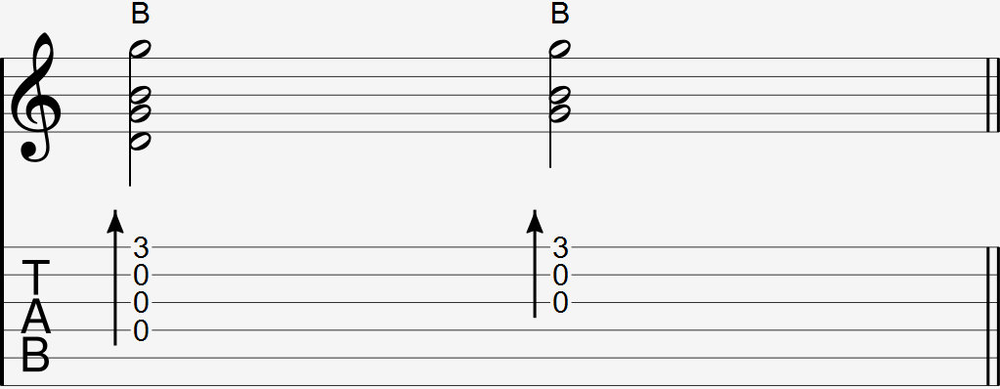

  

The bridge thump is commonly notated as a group of notes with a strum arrow and a B above the notation and/or tab. If the notation and/or tab shows an O above a segment that is palm muted, assume it is a bridge thump.

### Explanation

The bridge thump portion of this technique is done the same way. To add a strum, curl your middle and ring fingers into your palm and at the same time you do a bridge thump, strum the back of your fingernails across the strings. 

Do not overextend your strumming fingers in this movement. Your palm should open up just enough during the wrist thump so that your fingers strum across the strings.

When doing the bridge thump and strum at the same time, the palm muted notes should remain muted while every other note should ring normally.