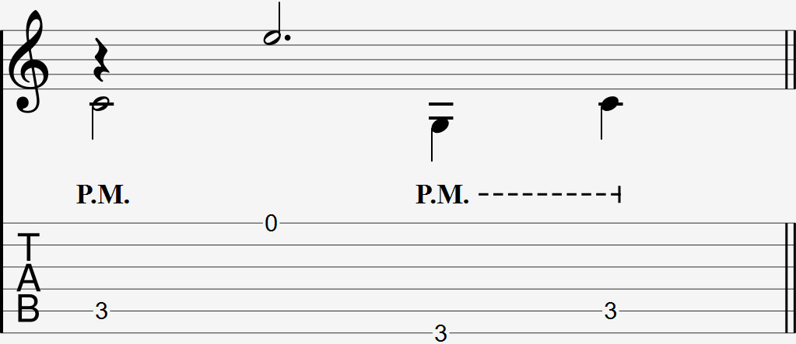

Video
- Palm mute lower string only, do arpeggio

### Notation

  

The palm mute is commonly notated as with PM directly above the string to be palm muted. If the palm mute extends to multiple notes in a row with a dashed line, all those notes are to be palm muted.

It can be confusing when a palm mute extends through even the higher strings. It's best to refer to the original piece to hear whether the higher strings are palm muted or not. Otherwise, assume the palm mute is only held on the lower strings.

### Explanation

The palm mute is used to variably deaden strings by reducing how much the string is able to sustain it's ringing after it was picked.

To do a palm mute, put the side of your palm closest to your pinky on the strings, slightly to the left of the guitar's saddle. When you pick, the strings that come in contact with the side of your palm have a more muffled sound than usual.

Try out different positions of palm muting. Move your hand further to the left of the saddle, then move your hand closer to it. Moving further away makes the palm make contact with more of the string(s), and deadens the string even more. Palm muting gently above the strings also palm mutes less compared to putting more pressure on the strings.