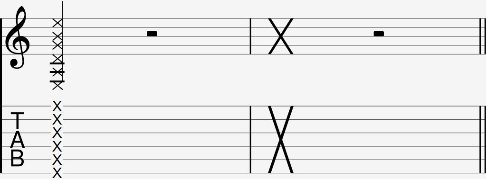

  

The palm slap is commonly notated as either multiple Xs covering the majority of the strings in a tab, or one giant X cover all the strings.

### Explanation

The palm slap is a percussive slap that also mutes every string it comes in contact with. The slap sound comes from the guitar string coming in contact with the fret wire itself.

To do the palm slap, straighten your right index, middle, and ring fingers and put them together as if you were offering to give someone a handshake. Then slap these fingers down onto the strings.

Like any percussion technique, make sure to not put too much strength into the slap. 

#### Palm slap follow-up

The palm slap commonly comes before an upwards [strum](16).