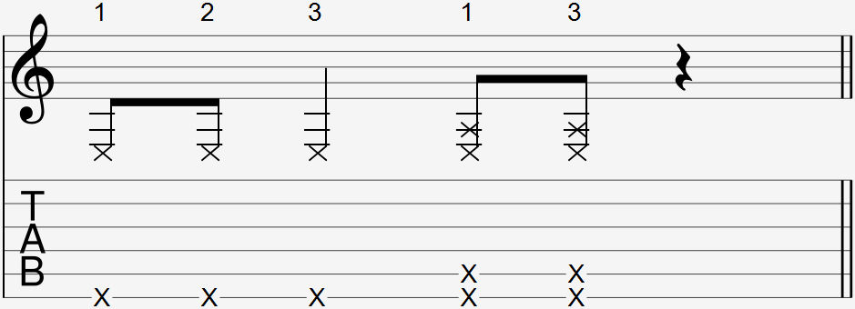

Video:
- Left hand slap

  

The left hand slap is commonly notated with one or more Xs with a number above, indicating the finger used on the right hand. 1 means index, 2 means middle, and 3 means ring. Using the middle finger for this technique is rare as it is the most difficult.

### Explanation

The left hand slap is a bass guitar technique that has been adapted into fingerstyle. The slap sound comes from the guitar string coming in contact with the fret wire itself.

To do a left hand slap, straighten out your slapping finger while holding the guitar neck and swing the fingertip down to the lowest string. As long as you do not need other strings to continue ringing, you can also let your swinging finger come into contact with them.

Your wrist should not move to assist with the swing. The swing should pivot from the knuckle connecting each finger to the palm.

#### How to practice the left hand slap

The following makes doing the left hand slap easier:

- Play the left hand slap on a higher fret such as the 7th fret.
- Practice with the ring finger first. Then index is more difficult to do a left hand slap with, and the middle is the most difficult.

As you get more comfortable practicing this technique using the above, slowly make approach frets closer to the 1st fret and use your index and middle fingers instead of the ring.

### FAQ

#### Why can't I get the slap sound?

If you are doing the slap motion correctly, it is normal not to achieve the percussive slap sound at first when your fingers are not used to the motion. Continue practicing the left hand slap and eventually your fingers will have enough explosive strength to produce the slap sound consistently.

If you find yourself having to slap really hard to get the slap sound, your guitar's action might be too high. The higher it is, the harder it is to do a slap. Conversely, the lower the action is, the harder it will be to control the volume of the slap, so it's important to find a middle ground. 