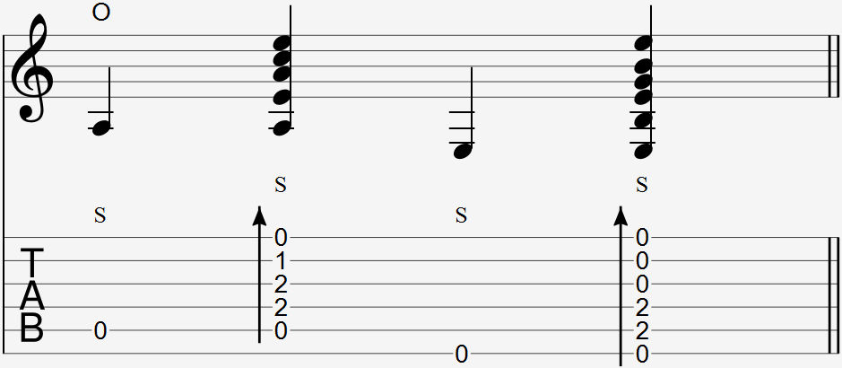

<strong>Hi Kent, what do you call this technique? I think "Slam Strum" is a fitting name, but I don't want to name a technique someone else created. Let me know.</strong>

Video: 
- slam 
- bass slam 
- slam strum

### Notation

  

The slam strum is notated with a strum beside a set of notes, an O to notate the wrist thump, and an S to notate the bass slap. If no strum is present but a bass note, O, and S is shown, then it is a bass slam, shown in step 2 below.

The lowest string out of the set of notes is to be played by the thumb as a bass slap combined with a thumb tap, while the rest of the notes are to be played by the strum.

### Explanation

The slam strum is a unique percussive technique by guitarist Kent Nishimura that combines the bass slap, thumb slap, and wrist thump strum into one technique.

Unlike the wrist thump strum where every string is strummed with a similar amount of power, the slam strum allows for a more distinctive, powerful bass to be played while also adding the sound of the thumb slap, wrist thump, and optionally, the strum. 

### Learning the Slam Strum

since the technique can be done in a large variety of different positions, the slap strum is difficult to do consistently and requires a lot of practice. The following can affect the difficulty of the slam strum.

- Distance between the slapped bass and strummed strings
- Which string the slapped bass is on
- Tension of the bass string (higher tension = harder)
- Number of strings to be strummed

This guide aims to make the process easier by gradually building the movements that make up the slam strum. Since this technique has multiple steps to learn, it will be separated into 3 sections. Refer to the video for the demonstration of each section.

#### 1. Slam (thumbslap + wrist thump)

The slam is is a combination of the thumb slap and the wrist thump techniques. The thumb moves with the wrist during the wrist thump and slaps the string at the same time the wrist hits the soundboard. 

Your thumb should also have a motion on it's own just like the thumb slap. Your wrist should not be the only part of your hand moving. The combined movements of both techniques will result in a clear click without buzzing.

To make it more convenient to learn the next section, instead of doing a thumb slap with the thumb landing on the string itself, aim to land between the target string and the adjacent higher string.

#### 2. Bass Slam

To add a bass slap to the slam, add an upwards motion to your thumb during the slap to ensure that the thumb continues to move upwards and away from the string after slapping it. This space between the thumb and string allows for the bass note to ring immediately after.

Doing the bass slam on the 5th string allows for the thumb to come in contact with the 6th string to get a percussive sound. 

Doing a bass slam on the 6th string is different from doing the bass slam on the 5th string. Since there isn't a lower string directly next to the 6th string for the thumb to slap, so the thumb needs to slap the 6th string itself using the same upwards motion as slapping the 5th string as described earlier, and finish by stopping the upwards motion on it's own.

#### 3. Slam Strum

The bass slam portion of this technique is performed the same way. To add a strum, curl your middle and ring fingers into your palm and at the same time you do a wrist thump, strum the back of your fingernails across the strings.

Since your thumb needs to stay in the same position to do a bass slam, instead of using your middle and ring fingers to strum like a wrist thump strum, you can use your index, middle, or ring finger only. It easier to strum lower strings using the index, higher strings using the ring, and strings in between using the middle.

Do not extend your strumming fingers in this movement. Your palm should open up just enough during the bass slam so that your fingers strum across the strings, and no more than that.