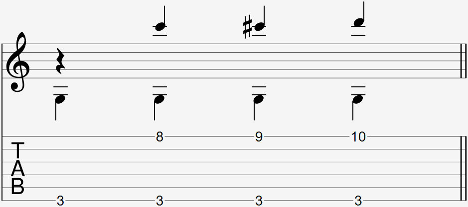

Video:
- Stretchy G chord standard Thumbover

  

There is no special way to notate a thumb-under. You can use the thumb-under whenever you need to press down on two frets that are too far away from another fret further up the fretboard.

### Explanation

The thumb-under makes it possible for further stretches be made on the fretboard. 

To do a thumb-under, move your wrist under your guitar's neck and place the side of your thumb on the string and fret. The pinky can then be placed at a fret further up the fretboard.

If you feel the thumb-under position is uncomfortable, try moving your wrist further out and away from yourself. This gives the thumb more room to avoid touching unwanted strings.