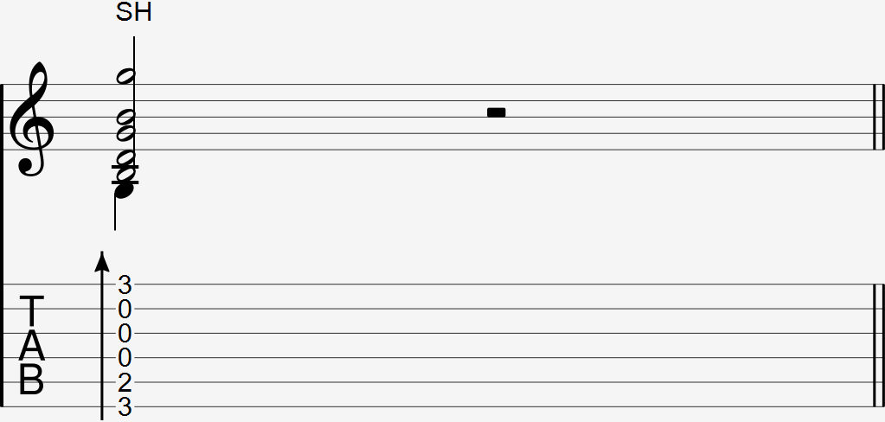

Video:
- E chord soundhole strum

  

Since the soundhole strum is very rarely used, there is no notation for this that is commonly agreed upon. It can be notated with an SH or a symbol directly above the sheet music that would be explained either next to the symbol or at the end of the sheet music.

### Explanation

The soundhole strum is a percussive technique used to add emphasis at the end of a strum.

To perform a soundhole strum, do a strum and at the end of the strum, hit the back of your fingernail on the edge of the guitar's soundhole.