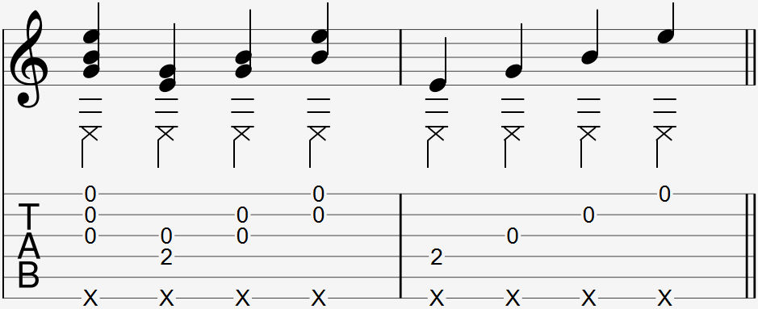

Video:
- Slap pluck (normal)
- Slap pluck (twist)
- remake the videos with thumbpick later

### Notation

  

The slap strum is most commonly notated as an "X" below a set of notes, where the X indicates the thumb slap and the notes indicate the strings to pick.

### Explanation

The slap pluck is a combination of your regular picking technique with a thumb slap, used to target specific strings. 

This technique will be counterintuitive to those who are used to the slap strum technique, as it requires two opposite movements to be performed by the same hand.

#### Slap pluck (with twist)

A slap pluck can also be done in one movement through the rotation of your wrist. The tone is different and it is used to put emphasis on a note.

#### Slap pluck vs Slap Strum

The slap pluck is a useful alternative to the slap strum when specific strings are to be played during the slap. It is more accurate to slap pluck when targeting specific notes than to slap strum the same notes. Doing a slap pluck on one or two strings sounds very different in tone when compared to a slap strum. 

A slap strum's tone is similar to an aggressive downpick while a slap pluck's tone is close to your usual picking tone. A slap pluck also makes controlling dynamics easier and when done right.