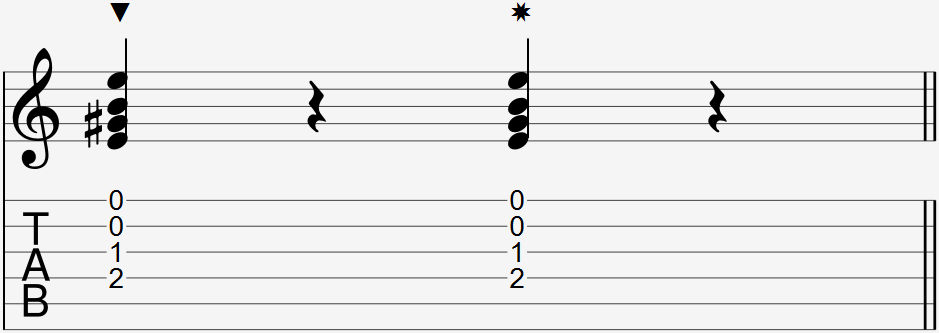

Video:
- Thumb tap with side
- Thumb tap with nail

  

### Explanation

There is no notation for the thumb tap strum that is commonly agreed upon. The thumb tap strum can be notated with a symbol direction above or below a set of note, that would be explained either next to the symbol or at the end of the sheet music. Sometimes, there will also be a strum arrow indicating the strum.

### Explanation

The thumb tap uses the same motion of a thumb slap strum, but instead of hitting the string with the thumb, either the side of the thumb or the thumb nail hits the guitar's soundboard while another finger is doing a quick strum at the same time as a thumb tap.

The motion can be more awkward than the thumb slap strum as it requires you to open your palm more and gives you less control over what strings you're hitting.

#### Changing the sound of the thumb tap

Just like the thumb tap, the sound of the tap can change depending on if you use your thumb nail, the side of your thumb, or a combination of both.