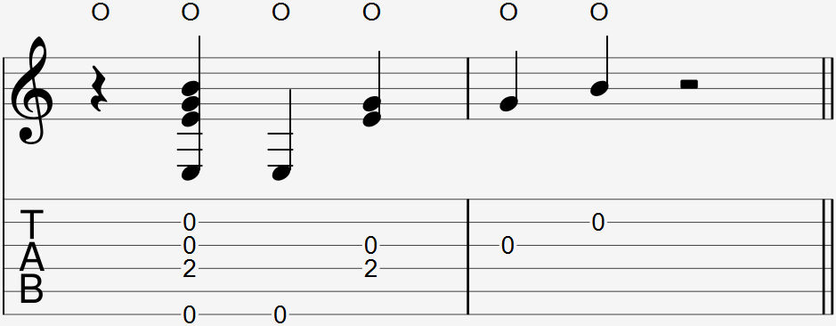

  

The wrist thump is commonly notated as an O above the notation and/or tab.

### Explanation

The thump sound, contrary to it's own name, does not come from the wrist coming in contact with the guitar's body. It comes from the fleshy part of the palm directly above your wrist coming in contact with the guitar's body above the soundhole. This sound is similar to a kick drum, commonly used on every beat or on beats 1 and 3 in modern music.

The thumping motion is done by arching your hand back at the wrist to dig your lower palm into the guitar's body. It's alright to use some strength from your arm to improve the power of this motion, but like all percussive techniques, make sure it's not too loud.

#### picking a bass note while doing a wrist thump

Place your thumb on the string you intend to pick and apply pressure as if you're about to pick. When you do the wrist thump, move your thumb away from the string. Pay attention to make sure you pick and wrist thump at the same time, as it is to mistakenly first wrist thump then pick.

#### picking other notes while doing a wrist thump

Place your finger(s) on the strings you intend to pick. When you do the wrist thump, pull your fingers towards your palm. This motion, combined with your wrist arching back, will pull the fingers away from the string and pick them like any other pick.

### FAQ

#### Why does my wrist thump sound different than _'s?

A wrist thump's sound can be different for many reasons which are not easily changed:

- Your guitar's soundboard material
- Your guitar's body shape
- The body fat around your palm
- The mixing of the audio recording

Don't worry about the sound differences, the wrist thump sound is not important when the main purpose of it is to contribute to the rhythmic feel of your playing.

#### Why does my wrist hurt?

If you start feeling pain or soreness from your wrist, stop immediately and rest until the area has recovered. Through long sessions of using wrist thumps, you can get bruising on the area your palm makes contact with the guitar or get fatigued through DOMS on your forearm. Any other source of pain or soreness is not normal. Try to practice using the wrist thump more gently. 