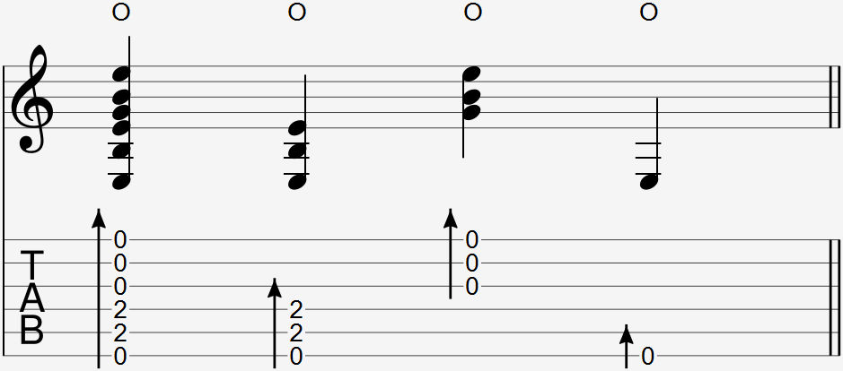

  

The wrist thump strum is commonly notated as a group of notes with a strum arrow and an O above the notation and/or tab.

### Explanation

The wrist thump portion of this technique is done the same way. To add a strum, curl your middle and ring fingers into your palm and at the same time you do a wrist thump, strum the back of your fingernails across the strings by opening up your palm. Some find it easier to only using the middle fingernail to strum.

Do not overextend your strumming fingers in this movement. Your palm should open up just enough during the wrist thump so that your fingers strum across the strings.