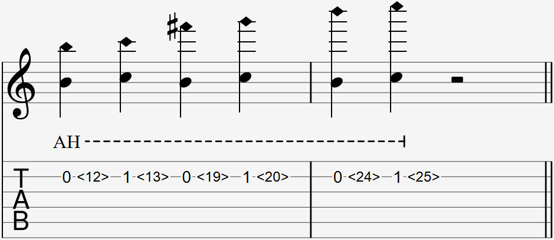

Video:
- 3<15> artificial harmonic from the front
- 3<15> artificial harmonic from the side

  

The artificial harmonic has many ways to be notated, and can be confusing. However, A.H. is commonly written above the harmonic to differentiate it from a natural harmonic. You will only see one of these styles used in one music sheet.

For example:

- 3<22> - left hand presses on fret 3; right hand touches and picks fret 22
- <19> with A.H. above - right hand touches and picks fret 7
- <0> or 0 with A.H. above - right hand touches and picks fret 12

### Explanation

Like a natural harmonic, an artificial harmonic is played by gently touching (not pressing down on) the string directly above the fret wire at the frets described below. Instead of using your left hand to touch the strings, touch with your right index finger and pick with your right ring finger.

This technique can play harmonic notes that natural harmonics cannot. By fretting a string with your left hand, you can play harmonics at higher frets by using the artificial harmonic on the fret that is a common harmonic fret number (12, 7, 19, 5...) higher than your current fret number.

#### Common Harmonic Frets

For your reference. The parentheses () show the intervals of the harmonic note when compared to the open string or the fretted note.

- 1/2 = <12> (Octave)
- 1/3 = <7> <19> (Octave + 5th)
- 1/4 = <5> <24> (2 Octaves)
- 1/5 = <4> <9> <16> <28> (2 Octaves + 3rd)
- 1/6 = <3.2> <30> (2 Octaves + 5th)

### FAQ

#### How do I play 0<24> if my guitar doesn't have enough frets?

The harmonic note you get depends solely on the integer divisors of the string. Your frets themselves aren't involved in the production of the harmonic note, they are just conveniently right below the most common harmonic frets so they're used as guides on where to put your finger. This is also why harmonics such as <3.2> exist. 