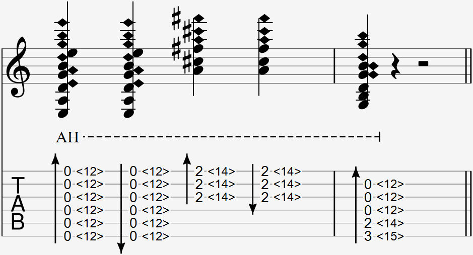

  

The sweep harmonic is notated with a set of artificial harmonics and a strum arrow.

### Explanation

The sweep harmonic is used to play multiple artificial harmonics at once with a strum on open strings, barred strings, or strings held down in a chord shape. 

#### Open and barred sweep harmonic

To do a downwards sweep harmonic on the same fret, place your right index finger over the string to be strummed first just as you would in an artificial harmonic and rest your ring finger nail above the string. Then, while maintaining the shape of your hand, move your arm downwards, keeping the index finger gently touching the string above the same fret wire with your ring finger strumming past each string from above.  

You can use your thumb instead of your ring finger to approach the sweep harmonic from a different position.

For an upwards sweep harmonic, do the same thing but in the opposite direction, with your ring finger strumming past each string from below.

You can control how loud the sweep harmonic is by relaxing and tensing your ring finger during the strum. 

#### Chord sweep harmonic

Doing the sweep harmonic on chord shapes can be significantly more difficult than doing the sweep harmonic on open or barred strings, since you need to properly strum every harmonic note in the chord shape. The difficulty gets harder the more complex the chord shape is, and the faster you do it.

A popular way to sweep harmonic without worrying about being absolutely accurate is by strumming the harmonics in more of a straight line. This method makes the technique easier at the cost of the harmonics' clarity.

The finger positioning of the sweep harmonic strum is the same as the open sweep harmonic strum. Instead of simply strumming down, your hand also needs to move to the fret wire the index needs to hover over to produce the individual harmonics. 