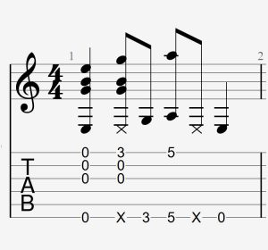

## Sample Technique Page

Alls of this is unstyled right now and looks terrible. If you're viewing this page from a mobile device then it'll look even worse.

There will be a **lot** more content here when the site fully launches.

There would be a demonstration video at the top of each page

Followed by common ways the technique is written in tabs:

  

**And of course the tabs will be affected by dark mode as well.**

(Note: There will be more than one image for most of these)

...and then more text content explaining how the technique is done.

At the bottom of the page, there will be tabs for exercises you can do on your own time.
